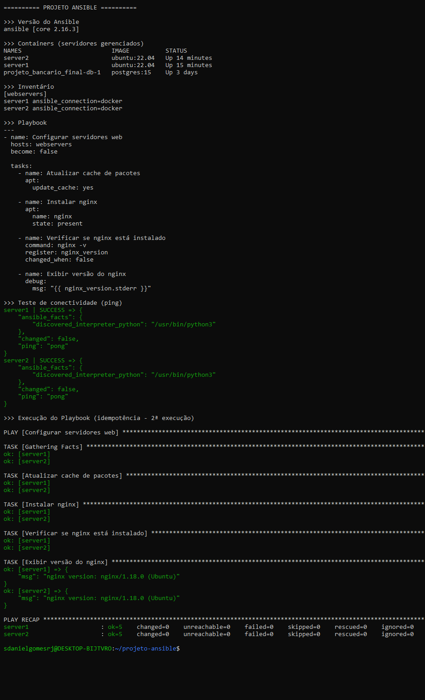

# projeto-ansible

Laboratório prático de automação de infraestrutura com Ansible, executado localmente usando containers Docker como servidores gerenciados.

## Objetivo

Demonstrar o uso do Ansible para configuração automatizada e idempotente de servidores, simulando um ambiente real com múltiplos hosts.

## Tecnologias utilizadas

- Ansible 9.2 (core 2.16.3)
- Docker Desktop + WSL2 (Ubuntu 24.04)
- Ubuntu 22.04 (containers como servidores)

## O que o playbook faz

- Atualiza o cache de pacotes
- Instala o nginx nos servidores
- Verifica e exibe a versão instalada

## Idempotência

O playbook utiliza módulos nativos do Ansible em vez de comandos raw, garantindo que execuções repetidas não causem efeitos colaterais. Na segunda execução o resultado é changed=0.

## Como executar

1. Subir os containers: docker run -d --name server1 ubuntu:22.04 sleep infinity
2. Instalar Python: docker exec server1 bash -c "apt update && apt install -y python3"
3. Testar conectividade: ansible all -i inventory/hosts.ini -m ping
4. Executar o playbook: ansible-playbook -i inventory/hosts.ini playbook.yml

## Demonstração

